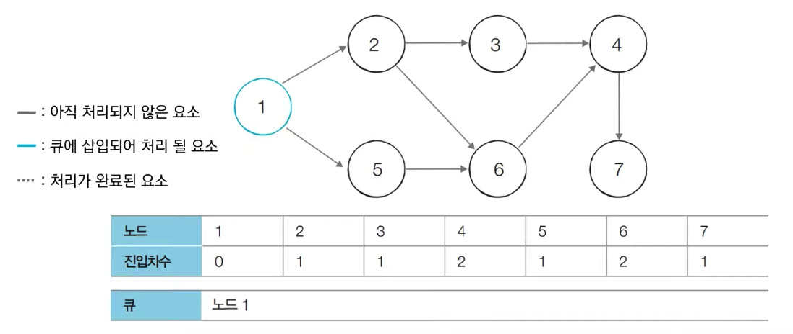
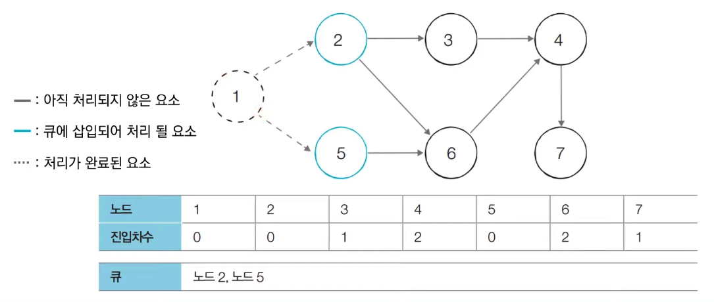
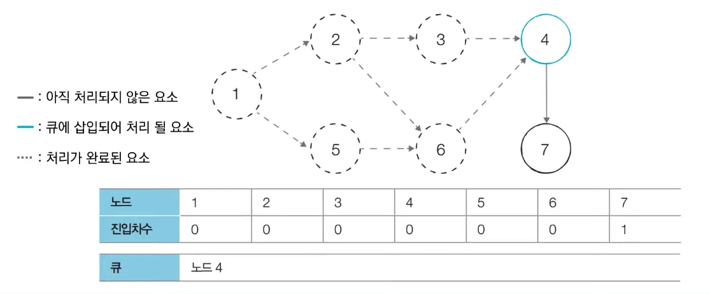
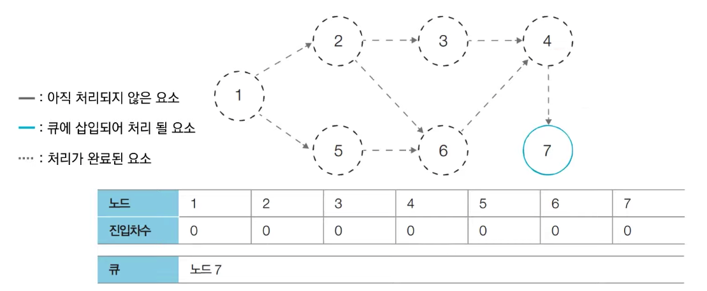
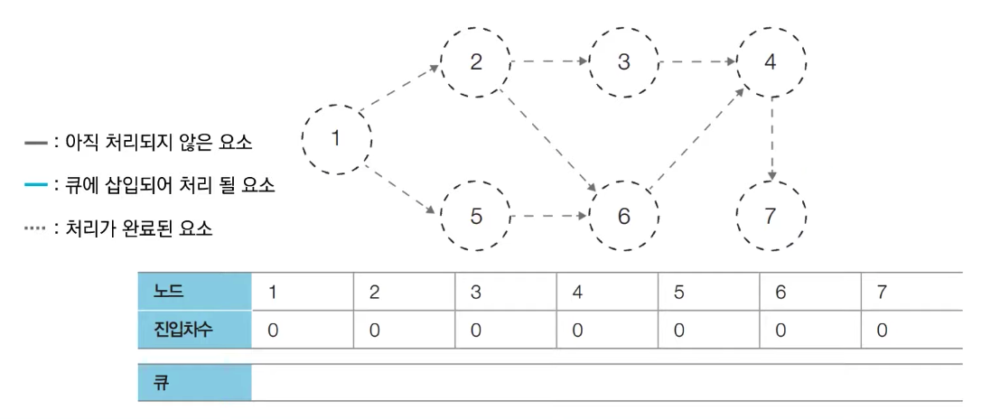

# 위상 정렬(Topological Sort)

## 정의

- **순서가 정해져 있는 작업을 차례로 수행**해야 할 때 그 순서를 결정해기 위해 사용하는 알고리즘
- **사이클이 없는 방향 그래프의 모든 노드를 방향성에 거스르지 않도록 순서대로 나열하는 것**
- 그래프의 흐름을 **조건**으로 해석할 수 있음
- 하나의 DAG에 대하여 위상 정렬을 한 결과가 여러 개일 수 있음


## DAG(Directed Acyclic Graph)

- 위상 정렬의 필요조건인 DAG를 알 필요가 있음
- Directed Acyclic Graph
  - Dicrected: 방향성이 있음
  - Acyclic: 사이클(순환)이 없음
- DAG는 **방향성을 가지며**, 어떤 노드에서 시작해도 **같은 노드를 다시 방문할 수 없는 그래프**
- 위상 정렬은 노드 간의 선행 관계를 따라 순서를 정해야 하는데, **사이클이 존재하면 선행 관계에 모순이 발생**


## 동작 방식 및 구현

구현은 BFS(in-degree), DFS 둘 다 가능

#### cf. 용어

- 진입차수 (Indegree): 특정 노드로 **들어오는 간선**의 개수
- 진출차수 (Outdegree): 특정 노드에서 **나가는 간선**의 개수

### 진행 순서 (BFS)

1. Indegree가 0인 모든 노드를 큐에 넣는다
2. 큐가 빌 때까지 아래 과정을 반복
   1. 큐에서 노드를 하나 꺼내고 해당 노드에서 나가는 간선을 그래프에서 제거 (각 노드의 Indegree 값을 1씩 뺀다)
   2. 나가는 간선에 속한 노드들 중 Indegree 값이 0이 된 노드를 큐에 삽입
3. 큐에 들어온 노드의 순서가 위상 정렬을 수행한 결과


##### 1. Indegree가 0인 모든 노드를 큐에 넣는다

아래 그림에서 `노드 1`이 큐에 삽입




##### 2. 큐에서 `노드 1`을 꺼낸 뒤 `노드 1`에서 나가는 간선을 제거

제거한 결과 새롭게 Indegree가 0이 된 노드들을 큐에 삽입




##### 3. 큐가 빌 때까지 2의 과정 반복









#### 위상 정렬 결과

큐에 삽입된 노드 순서이므로 **1 &rarr; 2 &rarr; 5 &rarr; 3 &rarr; 6 &rarr; 4 &rarr; 7**


#### 구현

```python
def topologicalSort(g):
  	indegree = [0] * g.V
    
    for v in range(g.V):
      	for w in g.adj[v]:
        		indegree[w] += 1
    
    queue = deque([v for v in range(g.V)])
    result = []
    
    while queue:
      	v = queue.popleft()
        result.append(v)
        
        for w in g.adj[v]:
          	indegree -= 1
          	if indegree[w] == 0:
            		queue.append(w)
    
    return result
```

해당 코드는 input g가 DAG라고 가정하고 작성됨


### 진행 순서 (DFS)

- DFS를 활용하는 경우 **DFS 순회의 역순이 위상정렬의 결과**
- DFS는 일반적으로 재귀함수이므로 각 회차를 `DFS()`라고 하자

1. `DFS()`가 종료할 때마다 현재의 정점 번호를 기록
2. 모든 DFS가 종료된 뒤, 기록된 순서를 뒤집으면 위상 정렬의 결과


#### 구현

``` python
def topologicalSort(g):
    def dfs(v):
        visited[v] = True
        for w in g.adj[v]:
            if not visited[w]:
                dfs(w)
                result.append(w)

    visited = [False for _ in range(g.V)]
    result = []
    idx = 0
    while len(result) <= g.V-1 and idx < g.V:
        if not visited[idx]:
            dfs(idx)
            result.append(idx)
        idx += 1

    result.reverse()
    return result
```


#### reference

- https://m.blog.naver.com/ndb796/221236874984
- https://velog.io/@kimdukbae/%EC%9C%84%EC%83%81-%EC%A0%95%EB%A0%AC-Topological-Sorting
- https://sunrise-min.tistory.com/entry/%EC%9C%84%EC%83%81-%EC%A0%95%EB%A0%ACTopological-sort-BFSDFS
- https://freedeveloper.tistory.com/278?category=888096
